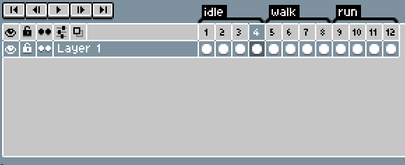

# Gif Sequencing

An Aseprite extension that allows you to export your sprite as a gif with the tags in a custom order!

## How to Use Gif Sequencing

1. Download this extension by visiting the releases page! (Double click the extension once downloaded to install)
2. In Aseprite, select `File > Export Gif Sequence`
3. Use the dialog windows to construct and export a custom gif sequence!

## What is a Gif Sequence?

A gif sequence is simply another way to export your Aseprite animation as a .gif file. However, this plugin will allow you to build up your animation based on the timeline tags. This allows you to use more flexibility when creating your animations. In the image below, the timeline only has 1 set of frames for idle, walking, and running, but the gif sequence is built in such a way that the .gif fully expresses what the animation will look like within your project.

## Sequence Presets

Gif Sequence supports the use of presets. Simply save the current sequence as a preset by clicking the checkbox and entering a name for the sequence, then clicking the save button. Now, whenever you load Gif Sequencing, you can select a preset from the dropdown at the top of the window and it will automagically populate the sequence for you! Want to edit a preset you already have defined? Simply save it again under the same name!

## Credits

This extension was commissioned by [@2dchaos](https://twitter.com/2dchaos) on Twitter! Thank you!

As an advocate of open-source software, feel free to suggest edits, or just fork this repository and make your own! The license on this software is open for commercial and private use. This extension will remain free forever; however, if you'd like to buy me a coffee, you can do so here: 

